<div align="center">
  
 

# Yet Another RAG System (But This One Has Daddy Issues)

</div>

> **Built By An Auditor Amid Glorious Gap Between Jobs And Sanity**
>
> *"It's not a bug, it's a feature request from my therapist"*

[](https://choosealicense.com/licenses/mit/)
[](#)
[](#)
[](#)
[](#)
[](#)
[](#)
[](#)
[](#)
[](#)

---

## WTF Is This?

A production-grade RAG (Retrieval-Augmented Generation) system built by someone who:

- Has no CS degree
- Somehow understands async/await
- Was unemployed long enough to over-engineer this into oblivion
- Thought "let me just add a circuit breaker" was a normal thing to say
- Believes "vibe coding" is peer-reviewed methodology

**In English:** It's like ChatGPT, but for your documents, with more paranoia, better security theater, and a concerning amount of audit logs. Designed for when 'Minimum Specs' is your daily driver: **Local-first, cloud-maybe, failure-always.**

**In Technical:** A full-stack RAG system with swappable backend components, multi-layer caching, behavioral rate limiting, MFA, CSRF protection, real-time monitoring, compliance reporting, and enough over-engineering to make Senior Engineers weep tears of joy and confusion.

**In Therapy Speak:** A coping mechanism that produces embeddings.

**Perfect for:** Nothing.

The development was done on a 2015 machine (4 GB RAM - 2 Cores) because this is how I **"measure"** performance, **"real-time"** from the device behavior as nothing motivates optimization like a single loud fan.

**If "it works fast on my machine" then "it works fast everywhere". This is the way-forward for engineering!** 🔥

---

## Getting Started (Good Luck)

> *"When semantic search fails, fall back to CTRL + F"*

###  Prerequisites

- A computer (or the like)
- Python 3.10+ (or whatever version that doesn't break everything)
- Node\.js 22+ (choose the vulnerable ones)
- PostgreSQL 18+ with pgvector extension (or just use SQLite, I won't judge)
- An LLM API key (Optional when local fails, **and it will!**)
- Ollama installed
- Low expectations (**mandatory**)

---

### Installation

**Step 1: Clone This Beauty**

```bash
git clone https://github.com/AmMoPy/DOX

# Enter the abyss
cd DOX
```

**Step 2: Basic Setup**

```bash
# Decend the abyss
cd backend

# Option A: Let the script do it (recommended)
cd scripts
python setup.py OR ./setup.sh # Windows: double-click setup.bat

# This handles:
# - Virtual environment creation
# - Dependency installation (backend/frontend)  
# - Model downloads
# - Next Steps

# Option B: Manual mode
You_are_on_your_own
```
---

### Running The Thing

**Terminal 1: Backend**

```bash
# Activate the virtual environment
cd backend
source venv/bin/activate  # Windows: venv\Scripts\activate

# RUN
python main.py

# Should see:
# INFO:     Application startup complete
# INFO:     Uvicorn running on http://0.0.0.0:PORT_N
```

**Terminal 2: Frontend**

```bash
cd frontend  
npm run dev

# Should see:
# VITE v7.x.x ready in XXX ms
# ➜ Local: http://localhost:PORT_N/
```

**Terminal 3: PostgreSQL (IF Used)**

```bash
sudo systemctl status postgresql # Windows: IDC
```

**Terminal 4: Process Monitoring**

```bash
top # Windows: Task Manager GUI
```

**If Backend Fails:**
```bash
# Check database connection (Postgress)
# Run these from project root
python -m scripts.test_pg_conn
python -m scripts.test_pg_pool

# Check dependencies
pip list | grep requirements.txt  :D

# Check Python version
python --version

# Read error message
# Google error message
# Copy error to your favorite LLM
# Fix
# Repeat

# Do fresh scripted install
```

**If Frontend Fails:**
```bash
# Clear cache
rm -rf node_modules .vite
npm install

# Check Node version
node --version

# Try different port
npm run dev -- --port 3000

# Still broken?
# Turn off computer
# Turn on computer
# npm install again

# Doesn't work?
# You sucks!
```

---

### First Run Experience (DEV MODE)

**1. Visit `http://localhost:PORT_N`**

You should see a login page. If you don't:

- Check if frontend is running
- Check browser console for errors
- Check if you typed the URL correctly (we've all been there)

**2. Create Admin Account - If Disabled Auto Creation**

visit `http://localhost:PORT_N/setup`

```
Email: ana@hena.com
Password: 123
Confirm Password: 456
```

First user = automatic admin powers 👑

**3. Upload Some Documents**

Navigate to `/admin` → "Upload Documents"

Supported formats:

- 📄 PDF (works great)
- 📝 DOCX (mostly works)

Progress bar will show **fake** upload status (fancy!)

**4. Start Searching!**

Go to `/search`

Try queries like:

- "Why my life sucks?"
- "What does this document say about ME?"

Watch the magic happen (NOT FOUND ERROR) ✨

---

### Troubleshooting (When Things Inevitably Break)

8\. Check the overwhelming logs

7\. Google the error

6\. Check GitHub issues

5\. Ask your favorite LLM

4\. Take a break

3\. Try again

2\. Open an issue on this repo

1\. @AmMoPy (if I'm still unemployed, I'll probably respond)

---

### Next Steps

After installation:

1. Explore the admin dashboard
2. Upload some test documents
3. Try different search queries
4. Check out the security dashboard
5. Generate a compliance report (for fun)
6. Marvel at the audit logs
7. Customize the settings
8. Break something
9. Fix it
10. Feel accomplished

**Ready to deploy?** I'm not.

**Want to contribute?** You must be unemployed too!

**Need help?** Open an issue so I can delete it.

**Enjoying this?** Give it a ⭐ on GitHub (my ego needs it)

---

## Architecture

> *"The System That Ended an Audit Career"*

```mermaid
graph BT
    subgraph "Frontend - SolidJS"
        A[User] --> B[Auth Components]
        A --> C[Search/Chat UI]
        A --> D[Dashboards]
        B --> E[API Client]
        C --> E
        D --> E
    end
    
    subgraph "Backend - FastAPI"
        E --> F[API Endpoints]
        F --> G[Auth Manager<br/>Trust No One]
        F --> H[Search Service<br/>Vector Go Brrrr]
        
        G --> I[Security Providers<br/>Paranoia Layer]
        I --> J[Local Auth<br/>Actually Works]
        I --> K[OIDC/SAML<br/>Coming Soon™]
        
        H --> L[Cache Layer<br/>2-Tier Like My Trauma]
        L --> M[Database Factory<br/>Choose Your Fighter]
        
        M --> N{Storage<br/>Pick One}
        N -->|Serious Mode| O[PostgreSQL<br/>+ pgvector]
        N -->|Lazy Mode| P[SQLite<br/>+ ChromaDB]
    end
    
    subgraph "External Services"
        Q[LLM Client<br/>Local/Cloud]
        R[Embedding Client<br/>Local]
        S[Email Service<br/>Password Resets]
    end
    
    H --> Q
    H --> R
    G --> S
```

<details>
<summary><h3>High-Level Overview</h3></summary>
  


</details>

**What You're Looking At (upside down):**

- A system with more layers than my emotional barriers
- Enough abstraction to make a CS professor quit
- Architecture so clean it makes Marie Kondo jealous
- The result of one too many "what if..." thoughts

```mermaid
sequenceDiagram
    participant U as User
    participant FE as Frontend<br/>(Pretty UI)
    participant API as FastAPI<br/>(The Bouncer)
    participant Auth as Auth Manager<br/>(Trust Issues)
    participant Cache as LRU Cache<br/>(Memory Gold)
    participant DB as Database<br/>(Truth Storage)
    participant Embed as Embedding Client<br/>(Vector Witch)
    participant LLM as LLM Client<br/>(The Oracle)

    Note over U,LLM: Phase 1: Upload (User has hope)
    
    U->>FE: Upload Document
    FE->>API: POST /upload (w/ CSRF token)
    API->>Auth: Who dis?
    Auth-->>API: ✓ Legit (surprisingly)
    
    API->>API: File Processing<br/>(chunking, dedup, crying)
    API->>Embed: Make these chunks vectory
    Embed-->>API: Here's some floats
    
    API->>DB: Store this knowledge
    API->>Cache: Remember this
    DB-->>API: ✓ Stored (probably)
    
    API->>API: Log literally everything
    API-->>FE: Done! 🎉
    
    Note over U,LLM: Phase 2: Search (The Reckoning)
    
    U->>FE: "Find me that thing"
    FE->>API: POST /search
    API->>Auth: Still you?
    Auth-->>API: ✓ Still legit
    
    API->>Cache: You got this?
    
    alt Cache Hit (Lucky Day)
        Cache-->>API: Yeah fam, here
    else Cache Miss (Sad Trombone)
        API->>Embed: Do the thing again
        Embed-->>API: *sighs* fine
        API->>Cache: Remember THIS too
    end
    
    API->>DB: Find similar vectors
    DB-->>API: Here's the good stuff
    
    API->>LLM: Make this human readable
    LLM-->>API: *chef's kiss*
    API-->>FE: Results + AI wisdom
    FE->>U: Magic! ✨
```

<details>
<summary><h3>Data Flow Architecture</h3></summary>



</details>

**Translation:**

1. Admin uploads document → torture it into vectors
2. User searches → find similar vectors
3. LLM makes it pretty → User thinks I'm smart
4. Log everything → Auditors are happy
5. Cache makes it fast → Users are happy
6. Everyone happy → Me still unemployed

<details>
<summary><h3>Security Layers</h3></summary>


</details>

**Security Philosophy:**

- **Layer 1:** CSRF (because clickjacking is so 2010)
- **Layer 2:** CSP (inline scripts must show papers)
- **Layer 3:** Rate limiting (calm down there, hacker)
- **Layer 4:** Session validation (prove you're you)
- **Layer 5:** MFA (because I have trust issues)
- **Layer 6:** Audit logging (I will know what you did)

### Architecture Flex - **Swappable Everything™:**

- **🗄️ Database Backends**

	 - PostgreSQL + pgvector (serious mode)
   - SQLite + ChromaDB (casual Friday)
   - Factory pattern (design patterns are my love language)
   - Switch with one env variable (magic!)
  
- **🔐 Auth Providers**

	 - Local auth (works right now)
	 - OIDC (works in my dreams)
	 - SAML (works in theory)
	 - The architecture is there, I just ran out of time/motivation/tokens
  
- **📄 File Processors**

	 - None: Template Uploads (It's On You)
	 - Advanced: Deduplication, chunking, optimization
	 - LSH hashing for finding near duplicates
  
- **⚡ Circuit Breakers**

	 - Databases have feelings too
	 - Fails fast when things go wrong
	 - Self-healing (like me in therapy)
  
- **🏊 Connection Pooling**

	 - AsyncPG pool manager with health checks
	 - Connection reuse (we're eco-friendly)
	 - Handles failures gracefully
	 - Max connections respected (unlike boundaries in my personal life)
  
- **💾 2-Tier Caching**

	 - **Layer 1:** LRU cache in memory (fastest)
	 - **Layer 2:** Database cache (fast)
	 - Like Inception but for data
  
- **🧠 Hybrid GC Strategy**

	 - Memory management that doesn't leak
	 - Aggressive cleanup when needed
	 - Python's GC with trust issues

---

## Features

> *"Every feature is a cry for help wrapped in async/await"*

### Core Features

- **📤 Document Upload**

	 - PDF and DOCX support
	 - Progress tracking (faked)
	 - Drag & drop (because it's 2028)
	 - Multilayer structural processing (duh)
  
- **🔍 AI-Powered Search**

 	 - Talk to your documents (Psycho)
	 - Vector similarity (cosine distance go brrrr)
	 - LLM-generated answers (with sources!)
	 - Actually finds what you're looking for (sometimes)
	  
### Security

- **🔑 Multi-Factor Authentication** 

	 - Because passwords are for people who trust humans
	 - TOTP-based (your phone is the key now)
  
- **🛡️ CSRF Protection**

	 - Double-submit cookie pattern (fancy!)
	 - I read OWASP docs so you don't have to
	 - Protects against nothing
  
- **📜 CSP Headers with Nonce Injection**

	 - Content Security Policy (google it)
	 - Inline scripts must show papers (nonce)
	 - XSS attacks cry when they see this, or not!
  
- **🚦 Behavioral Rate Limiting**

	 - Not your grandma's fixed-window rate limiter
	 - Adapts to user behavior (machine learning? maybe?)
	 - Slows down suspicious activity (looking at you, bot)
  
- **🔐 Hashing and Encryption: SHA256, bcrypt, Fernet**

	 - GPU attacks is our sweet spot
	 - Brute-force me once, shame on you; twice, shame on me
	 - Salted, peppered, and seasoned to taste
  
- **🍪 Secure Session Management**

	 - HTTPOnly cookies (JavaScript can't touch this)
	 - SameSite=Lax (CSRF's worst nightmare)
	 - sessionStorage is for people who hate security
  
- **🔑 API Key Support**

	 - For the automation nerds
	 - Scoped permissions (principle of least privilege, baby)
	 - Revocable, rotatable, responsible
  
- **📊 Comprehensive Audit Logging**

	 - Every. Single. Action. Logged.
	 - Compliance reports on demand
	 - Dashboards that make auditors weep with joy
	 - "What did they do?" → *[pulls out audit log]*

**Security Level:** *Paranoid Auditor Who Learned to Code*

### Monitoring & Compliance (Dashboard Suite)

- **🚨 Security Dashboard**

	 - Failed login attempts (amateur hour)
	 - Suspicious activity (I see you)
	 - Active sessions (who's online?)
  
- **📋 Audit Log Viewer**

	 - Search, filter, export
	 - Compliance officer's wet dream
	 - "When did X do Y?" → Instant answer
	 - Time range queries (because details matter)
  
- **📄 Compliance Reports**

	 - Auto-generated (because manual is for chumps)
	 - Export to PDF/CSV
	 - Regulatory-ready (probably)
	 - Makes auditors happy (my people!)
  
- **⚡ Real-time SSE Updates**

	 - Server-Sent Events (one-way websockets)
	 - Live monitoring without polling
	 - Feels like magic, is actually HTTP
    
**My Feature Count:** *Yes*

---

## The Flex Section

> *"Look mom, I'm a real developer now!"*

This isn't a "struggling RAG" - **it's a "resource-constrained production system"** that uses 384d CPU embeddings; Built on Legacy Hardware, for Legacy Hardware and it **ACTUALLY WORKS.**

**Benchmarks: DOX First Audit Report**

| Metric | Expectation | Reality | Auditor's Note |
|---------|------------------|----------------|----------------|
| **Embedding Speed** | "Near real-time" | "2-5 seconds per chunk" | "Material weakness in performance" |
| **Query Response** | "Instant answers" | "Please wait..." | "Control deficiency in UX design" |
| **Accuracy** |"State of the art" | "Better than guessing" | "Non-compliance with accuracy standards" |
| **Memory Usage** | "Highly optimized" | "At least it doesn't swap" | "Inefficient resource allocation" |
| **Login Success Rate** |"Seamless auth"| "50% on first try" | "Authentication control failure" |

**Meet The Team**

This FLex Wouldn't Have Been Possible Without:

- **Claude - *Senior Overthinking Engineer***: Specializes in generating technically correct but practically questionable solutions. If poked aggressively, it slacks for 5 hours.
- **DeepSeek - *Consulting Architect***: Excellent at suggesting code that looks right until you read it. However, always on with generous unbillable hours. 
- **Gemini - *Intern***: The real MVP. Excels at technical deep dives.
- **The 2015 Laptop - *Head of Infrastructure*** : 4GB RAM, 2 cores, infinite patience. Teaches important lessons about memory management through frequent OOM errors. Also functions as a space heater.
- **Me - *Chief Observer Officer - COO***: Watches the team write code, occasionally types `git commit`, and takes credit for everything. Basically the project manager but with more imposter syndrome whose primary responsibilities include: 

	- Updating LinkedIn 
	- Token Management 
	- Keeping hallucination in-check 
	- Pretending to understand async/await. 

**Team Dynamics:**
The AIs argue about architecture, I pretend to understand, and we all agree that if it compiles, it's probably fine. Our standup meetings are just me reading error logs out loud.

**Things I Imported From Auditing:**

| Audit Skill | Engineering Translation |
|-------------|------------------------|
| Process mapping | → System architecture |
| Paranoia | → Security engineering |
| Risk assessment | → Error handling |
| Control Testing | → Debugging |
| Documentation | → This README |
| Compliance thinking | → Audit logging everywhere |
| Forensic Analysis | → Unit tests (in theory) |

### 🏆 Achievements Unlocked

- ✅ Built production-grade system with no CS degree (production-grade?)
- ✅ Made asyncpg and thread pools play nice
- ✅ Recursive Pydantic models work (against all odds)
- ✅ 2-tier caching actually saves resources
- ✅ Security that makes auditors happy
- ✅ Vibe coding validated as methodology
- ✅ Proved transferable skills are real
- ✅ Can now say "I know async/await" (lies)
- ✅ Built something that actually works (does it?)

**Confidence Level:** Fluctuates between "I'm a genius" and "I have no idea what I'm doing" (average: cautiously optimistic)

---

## Project Structure

>*"If you can't explain it simply, add more layers of abstraction"*

```
.
├── backend/
│   ├── app/
│   │   ├── api/           # FastAPI endpoints
│   │   ├── auth/          # Authentication & security
│   │   ├── config/        # Configuration management
│   │   ├── core/          # Core services (LLM, embeddings)
│   │   ├── db/            # Database implementations
│   │   ├── models/        # Pydantic models
│   │   ├── utils/         # Utilities (file processing, etc.)
│   │   └── val/           # Validation
│   ├── scripts/           # Setup scripts
│   └── main.py            # Application entry point
│
└── frontend/
    ├── src/
    │   ├── api/           # API client
    │   ├── components/    # UI components
    │   ├── routes/        # Page routes
    │   ├── stores/        # State management
    │   └── utils/         # Utilities
    └── public/            # Static assets
```

---

## Why This Exists

> *"From Finding Flaws to Creating Them: An Auditor's Descent into Code"*

- Auditors can do anything (we just come with trust issues)
- Transferable skills are real
- "Vibe coding" works (LLM hallucination + patience = software)
- Unemployment (THE REAL REASON)

---

## Contributing

> *It compiles. It deploys. It kinda works. What more do you want?*

- Found a bug? That's a feature.
- Want to improve performance? Buy better hardware.
- Have an idea? Keep it to yourself.

---

## License

MIT - Abuse without touching production!

---

**Built with ❤️, 😤, and ☕**

If you made it this far in the README, you must be:

1. Actually interested in using this (wow, thank you!)
2. Incredibly bored (I feel you)
3. A bot (beep boop)

Either way, thanks for reading! If you found this useful, entertaining, or both, 
consider giving it a ⭐ on GitHub. It feeds my ego and helps with employment prospects.

**Fun Fact:** This README is longer than some of my code files. 
That's either very good documentation or very bad prioritization. 
You decide.

---

<div align="center">

<sub>© 2026 - No rights reserved, honestly do whatever. Just don't drag my name into it</sub>

</div>